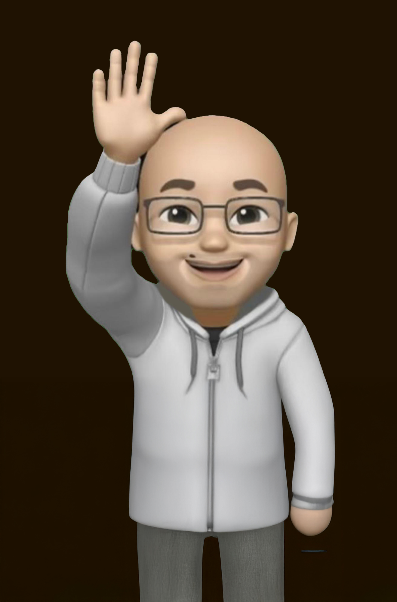

# 🐆 Grupo 7 - Panteras Sabias

Bienvenidos al repositorio oficial de nuestro equipo para el curso de **Programación para Videojuegos**.

## 🚀 Acerca del Proyecto
Este espacio está dedicado al desarrollo colaborativo de nuestro prototipo de videojuego. Aquí aplicaremos conocimientos sobre:
* **Motor de Desarrollo:** Unity 3D
* **Gestión:** Control de versiones con Git & GitHub
* **Roles:** Integración de Programadores, Artistas, Diseñadores y Testers.

## 🎯 Objetivo
Planear y construir la lógica y entorno de un videojuego funcional, documentando cada paso de nuestro aprendizaje y fortaleciendo nuestras habilidades de trabajo en equipo.

## 👤 Integrante: Manuel Maglioni

- **Rol:** Desarrollador integral de prototipos funcionales
- **Ubicación:** Cali
- **Perfil:** Soy un apasionado por la programación y la producción audiovisual. Me interesa fusionar la lógica técnica con la narrativa visual para crear experiencias de juego únicas.
- ** Plato Favorito:** ¡La pasta carbonara! (Ver imagen en mi carpeta)
